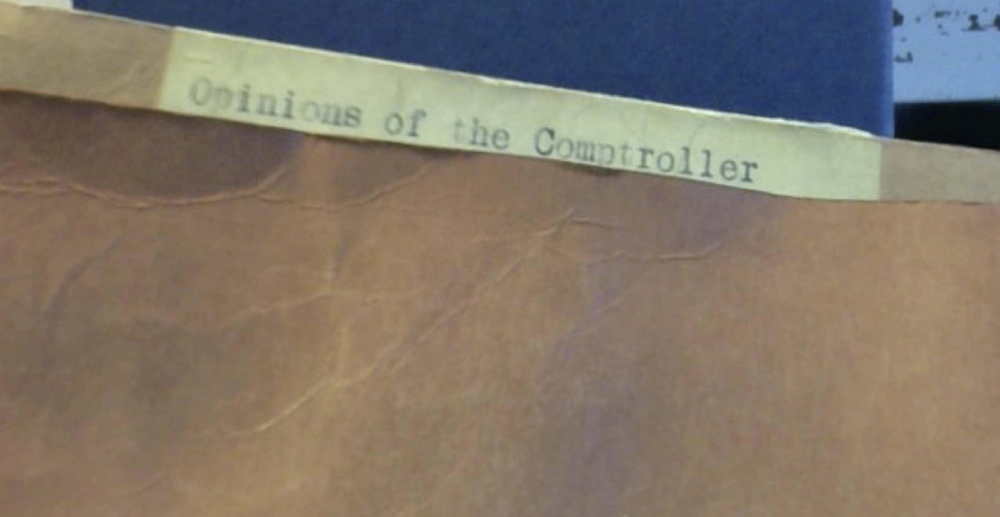

On February 20, moved by the sitting president's press conference in response to the Supreme Court striking down his signature economic policy, I [compared](https://erauchway.github.io/posts/2026-02-20_tariffs_SCOTUS/2026-02-20_tariffs_SCOTUS.html) it to Roosevelt's press conference on a similar occasion, thus mildly disputing [Moyn and Goldsmith's](https://www.nytimes.com/2026/02/02/opinion/trump-roosevelt-executive-power.html) argument that Trump's "executive power grabs have been arrestingly similar to ones pioneered by an iconic predecessor liberals revere: Franklin D. Roosevelt” during the New Deal. Samuel Moyn [courteously pointed out in response](https://bsky.app/profile/samuelmoyn.bsky.social/post/3mfelahtse22a) that he and his co-author wrote their piece prior to this press conference. [Absolutely fair](https://bsky.app/profile/rauchway.bsky.social/post/3mfexgblxe32z)---so let's think about some evidence that was available prior to their writing the piece, in the archives, which also cuts against the Moyn and Goldsmith case.

I don't know what archives Moyn and Goldsmith consulted in their study of the Roosevelt administration, but no scholar could travel to all of them---the National Archives are just the beginning. There's stuff in places you might not think of.

{width=50% .lightbox}

But wherever you go, time in the archives gives you a sense of how the Roosevelt administration worked.[^1] One thing you notice is, they often did not get their way.

Perhaps the least known but very important obstacle to the New Deal was the Comptroller General, the key officer of the General Accounting Office (now the Government Accountability Office). In various archives there are pages and pages of memos to do with the Comptroller General's opinions of the New Deal, which were dim indeed.

As you'll know (kidding, hardly anyone knows) the Comptroller General serves a fifteen-year term and approves all payments made by the federal government. The Comptroller General doesn't---or shouldn't---decide how to spend money: that's the job of Congress. He's an accountant, who sets up and oversees sound procedures for spending the money Congress has already appropriated.

Through almost all of Roosevelt's first term---and therefore through the key years of the New Deal---the Comptroller General was J.R. McCarl, appointed by Warren Harding. McCarl's politics reflected the circumstances of his elevation to what was meant to be a non-partisan office: he loathed the New Deal with all his heart, and sought to hobble it at every turn.[McCarl wrote two articles laying out his political beliefs and his vexation with the New Deal upon leaving office: @mccarl1936-10-03; @mccarl1936-10-17]

As Harvey C. Mansfield points out, McCarl---not the New Dealers---was the one here exceeding his authority, turning what was meant to be the purely "ministerial" accounting function  into a new, extra-Constitutional veto point unanticipated by the framers of his office.[@mansfield1939, 111. For those of you familiar with Harvey Mansfield the defender of manliness, this is his father, the political scientist] 

Folders like the one above contain all kinds of correspondence showing the Comptroller General putting the brakes on New Deal expenditures, ranging from quarrels over reimbursement for auto fuel used in business travel to denying money to the WPA---thus slowing or stopping relief projects altogether. McCarl prevented the use of processing-tax funds for agricultural relief in Puerto Rico. He blocked $15 million in Tennessee Valley Authority funds for no better reason, really, than that he didn't like the idea that Congress had made the TVA an independent corporation. 

Mansfield calculates McCarl's obstreperousness cost the TVA a direct cost of $200,000 and of course incalculable indirect costs in terms of delayed relief and reform in a time of emergency and economic devastation.[@mansfield1939, 242--244] Overall he slowed the New Deal and prevented it from extending as far as Congress intended.

And yet the administration conformed to McCarl's strictures even when they probably could have got around them. Here's Mansfield:

> It seems clear that the Treasury would have been legally justified in the circumstances in advancing the funds notwithstanding the Comptroller General's refusal to act. . . . It is understood that some such course of action was agreed upon at a conference of officials representing the TVA, the Treasury, and the Department of Justice, but that White House sanction could not be secured for a move that would precipitate an open break.[@mansfield1939, 242n40]

Now, if the Roosevelt administration had been pursuing progressive aims in the manner of a unitary executive, they would have behaved very differently. They might have fed the GAO [into a wood-chipper, to borrow a phrase,](https://xcancel.com/elonmusk/status/1886307316804263979?lang=en) and gone on to collect and spend money as they pleased. They didn't, because they had a higher priority.

The New Deal represented a sincere, politically astute, and immensely popular effort to save the United States from encroaching fascism. Roosevelt's proposed method of doing so was to demonstrate that the US government could achieve progressive ends without abandoning representative government or rule of law. Roosevelt aide Rex Tugwell mentioned this priority in his diary in 1934, writing that Roosevelt "is convinced that he can transform the country physically and morally in his time without any changes in government structure or in democratic processes."[@tugwell, November 26, 1934]

I suppose that's why I object more strongly than I might to the Moyn and Goldsmith opinion piece: it seems to me to get the purpose and function of the New Deal---which was to prevent the rise of fascism---exactly backward.

[^1]: Incidentally, you realize how many of them could write really well---after all, there were any number of bright, competent, well educated people eager for work in the Depression and happy for the opportunity to assist the New Deal.
