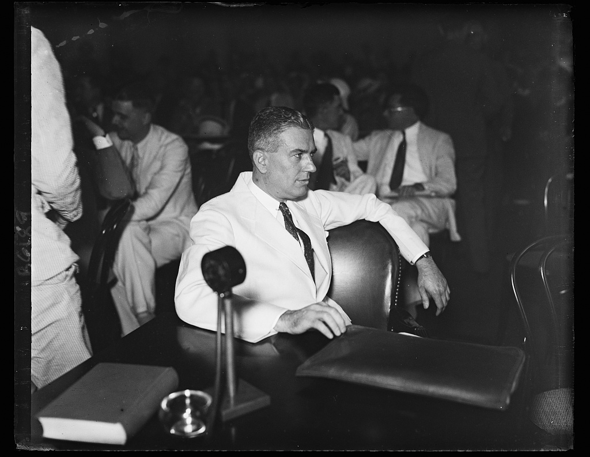

It remains a historiographical commonplace that Franklin Roosevelt led more by style than substance and that, as Oliver Wendell Holmes Jr. said, Roosevelt may have had a second-class intellect but a first-class temperament.

For myself I have never found this characterization satisfactory, and for essentially the reasons that Roosevelt's aide Rex Tugwell doubted it. (Tugwell was generally characterized, not unfairly, as a bit to the left of the president and of the mainstream of the New Deal.) 

Thinking back on Roosevelt's record, and on the temptation to characterize Roosevelt as a blithe spirit rather than a canny operator, Tugwell wrote,

> there would have been instances also, many of them, when everything had been superbly conceived and had been carried through with an élan and precision which would seem inspired. These last instances might, to the honest expert, have seemed to have about them a good deal of the accidental. It could not be denied, however, that they had happened. They had even happened repeatedly. . . . there it was! It had to be accepted. The inference was inescapable. It could not all be luck.[@tugwell1958]

I don't know for sure *why* it is so tempting to believe that Roosevelt cheerfully blundered his way through an immensely successful presidency. I suspect different kinds of people tend to believe it for different reasons. If, say, your economic knowledge allows you to understand that anything like the New Deal could not possibly succeed, it might be useful to believe that  Roosevelt was simply lucky that his presidency coincided with a period of recovery and strong economic growth with increasingly widespread prosperous returns---and that applies whether your economics are related to the political right or the political left. I think also that during the Cold War the idea of Roosevelt as a purely experimental pragmatist---in contrast to those sneaky planners behind the Iron Curtain---was attractive to liberals. 

But as Tugwell notes it seems pretty obviously wrong.
